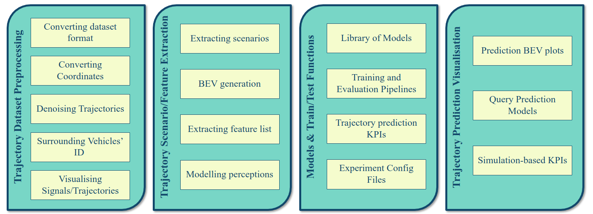

# Vehicle Trajectory Prediction Library


If you use any parts of this code, please cite us:
```
@article{mozaffari2023multimodal,
  title={Multimodal manoeuvre and trajectory prediction for automated driving on highways using transformer networks},
  author={Mozaffari, Sajjad and Sormoli, Mreza Alipour and Koufos, Konstantinos and Dianati, Mehrdad},
  journal={IEEE Robotics and Automation Letters},
  year={2023},
  publisher={IEEE}
}

@article{mozaffari2022early,
  title={Early lane change prediction for automated driving systems using multi-task attention-based convolutional neural networks},
  author={Mozaffari, Sajjad and Arnold, Eduardo and Dianati, Mehrdad and Fallah, Saber},
  journal={IEEE Transactions on Intelligent Vehicles},
  volume={7},
  number={3},
  pages={758--770},
  year={2022},
  publisher={IEEE}
}

```

## :gear: Installation
Make sure to clone all submodules using
```shell
git clone https://github.com/SajjadMzf/TPL.git --recursive
```

You may create a conda environment for all submodules using:
```shell
conda env create -f environment.yml
```

## :wave: Intro
This repository contains all submodules of vehicle trajectory prediction library (TPL). You may downlod the latest version of each specific submodules using following link:

- [Trajectory Dataset Preprocessing](https://github.com/SajjadMzf/TrajPreprocess)
- [Trajectory Scenario/Feature Extraction](https://github.com/SajjadMzf/TrajFeatures)
- [Trajectory Prediction Models and Train/Test Functions](https://github.com/SajjadMzf/TrajPred)
- [Trajectory Prediction Visualisation](https://github.com/SajjadMzf/TrajVis)
